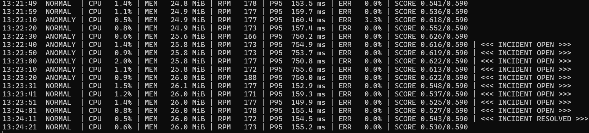

# Local ML Service Monitor

A CPU-only service monitor that learns common anomaly patterns from public
server telemetry, adapts them to one local service, and manages incident
lifecycles from live metrics.

The ML path produces one final `XGBClassifier`. CUDA trains it in Google Colab
on PSM and SMD; the saved tree model then runs with the smaller CPU-only XGBoost
package on the laptop. A normal recording from the monitored service calibrates
its scale and threshold.

[](https://colab.research.google.com/github/Cyaside/local-ml-service-monitor/blob/main/notebooks/train_universal_anomaly_model_colab.ipynb)

## How the model transfers across datasets

PSM, SMD, and the checkout service do not share metric names or dimensions.
Each 31-sample window is converted into the same 16 features describing robust
deviation, short and long changes, and fast-versus-slow drift. The classifier
therefore learns anomaly shapes instead of memorizing a particular CPU or
memory scale.

```text
PSM + SMD ──> universal temporal features ──> one foundation model (Colab)
                                                        │
local normal baseline ──> median/IQR + threshold ───────┤
                                                        ▼
                                                live service model
```

The public model is validated on an SMD machine excluded from development
training. The untouched local test recording remains the final acceptance
check because public telemetry cannot guarantee performance on this service.

## Live incident detection



The monitor opens an incident after three anomalous predictions in five samples
and resolves it after five consecutive normal predictions.

## Run locally

Requirements: Git, uv, and Python 3.12.

```powershell
uv sync --locked
uv run pytest -q
powershell -NoProfile -ExecutionPolicy Bypass -File scripts/start-local-monitor.ps1
```

Open the [Colab notebook](notebooks/train_universal_anomaly_model_colab.ipynb)
and choose **Run all**. It downloads PSM and SMD itself, trains the full model,
and downloads `telemetry-foundation-full.zip` when complete. Extract the ZIP
contents into `models/foundation-public-v1/`, then calibrate it using the
existing normal baseline:

```powershell
uv run service-monitor calibrate `
  --foundation models/foundation-public-v1 `
  --baseline data/exports/train-baseline-20260919T132930.csv `
  --out models/checkout-universal-v1

uv run service-monitor evaluate `
  --model models/checkout-universal-v1 `
  --input data/exports/test-20260919T180539.csv `
  --report reports/checkout-universal-v1-test.json
```

Run live monitoring after the held-out result is acceptable:

```powershell
uv run service-monitor monitor `
  --url http://127.0.0.1:8010 `
  --db data/live-monitor.sqlite `
  --model models/checkout-universal-v1 `
  --duration-minutes 30 `
  --allow-experimental `
  --pretty
```

## Repository layout

```text
src/service_monitor/           runtime monitor, storage, incidents, and CLI
src/service_monitor/checkout/  local FastAPI service and telemetry source
src/service_monitor/ml/        universal features, public training, calibration
notebooks/                     Google Colab foundation-model training
models/                        generated model bundles; local and ignored by Git
data/                          generated telemetry and public cache; local
runs/                          process logs and monitoring sessions; local
reports/                       generated evaluation output; local
image/                         documentation screenshots
tests/                         automated tests
scripts/                       Windows launchers and recording helpers
docs/                          system documentation
```

## Documentation

- [ML model and training](docs/ml-guide.md)
- [Architecture](docs/architecture.md)
- [Backend, collection, and monitoring](docs/backend-collector.md)
- [Docker](docs/docker.md)
- [Repository contents](docs/repository-guide.md)
