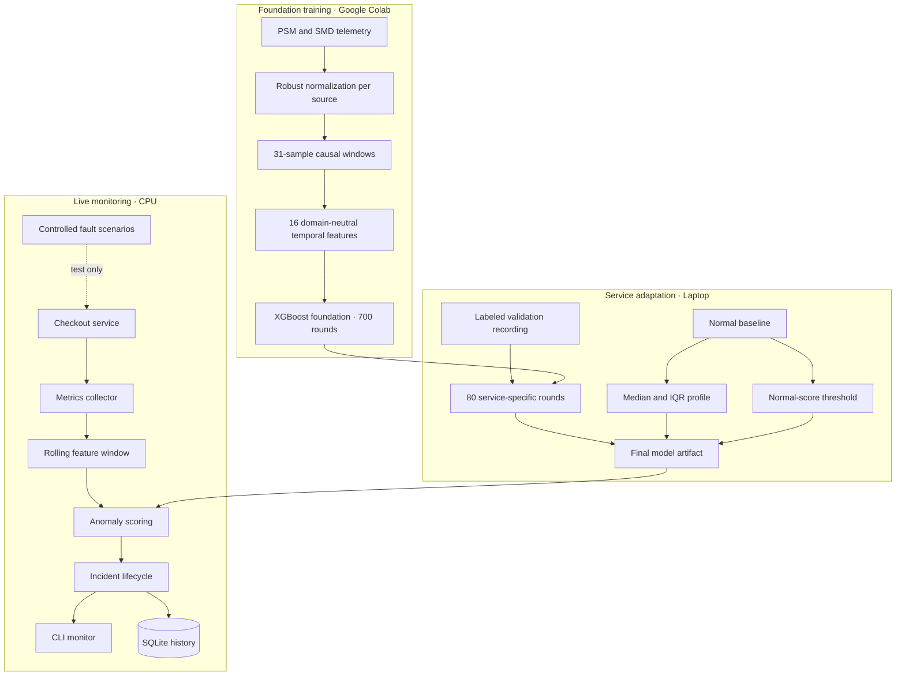
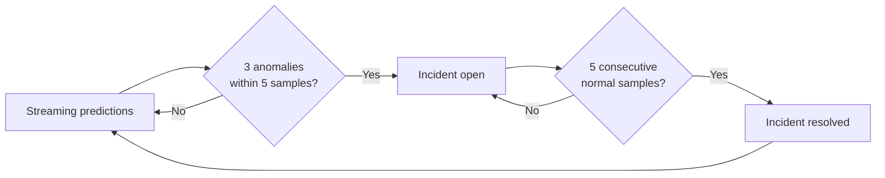
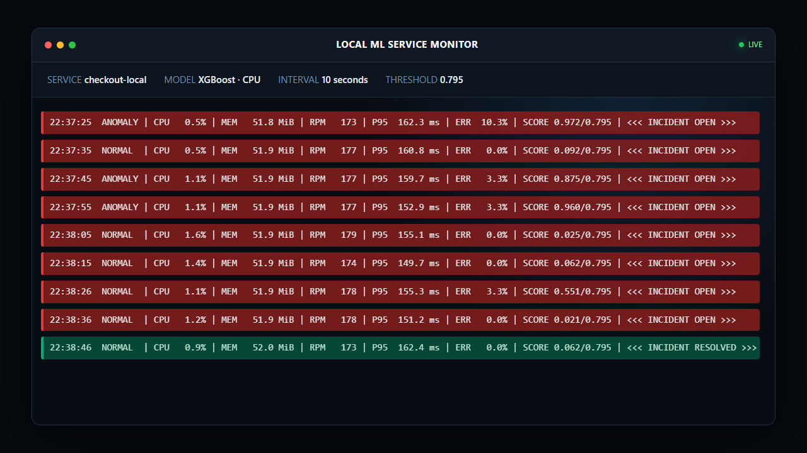

# Local ML Service Monitor

A lightweight service monitor that learns anomaly patterns from public server
telemetry, adapts one XGBoost model to a local service, and turns streaming
predictions into incident lifecycles. Training uses a Colab GPU; live inference
runs single-threaded on a laptop CPU.

## Model performance

The model is evaluated at two levels: cross-machine generalization on public
server telemetry and incident detection on a held-out recording from the
monitored service.

### Detection quality

| Evaluation | Test protocol | Result |
|---|---|---:|
| Public cross-machine ROC-AUC | 28,666 rows from held-out `SMD/machine-3-11` | **0.881** |
| Public cross-machine average precision | Same held-out machine | **0.325** |
| Public cross-machine event recall | Same held-out machine | **100%** |
| Local fault detection | Five unseen fault intervals | **5 / 5** |
| Local incident recall | Held-out local test recording | **100%** |
| False incidents | Observable normal intervals | **0** |
| Static-rule fault detection | Same local test recording | 3 / 5 |

The local acceptance test covers slow response, gradual latency degradation,
error bursts, memory growth, and combined degradation. Test data is excluded
from feature-profile fitting, local boosting, and threshold calibration.

### Runtime profile

| Metric | Result |
|---|---:|
| Final model size | **3.14 MB** |
| Batch inference | **43.7 ms / 1,000 rows** |
| Average inference time | **0.044 ms / row** |
| Runtime compute | **Single CPU thread** |
| Telemetry interval | **10 seconds** |

The public metrics are measured before the final foundation refit. The final
foundation is subsequently trained on all selected PSM and SMD entities. Full
local test output is available in
[`docs/results/checkout-universal-v1-test.json`](docs/results/checkout-universal-v1-test.json).

## Architecture



Only the final XGBoost artifact is used at runtime. There is no runtime ensemble
or model-selection menu.

## How the model works

The monitored service emits five measurements every ten seconds:

- process CPU percentage;
- resident memory in MiB;
- requests per minute;
- p95 request latency;
- error rate.

PSM, SMD, and the local checkout service have different metric names, scales,
and dimensions. Each source is normalized against its own normal median and
interquartile range. A causal 31-sample window is then converted into 16 fixed
features describing:

- current robust deviation and the proportion of extreme dimensions;
- positive and negative changes over 1, 6, and 30 samples;
- short-versus-long drift;
- the strongest current positive and negative deviations.

This representation lets the same classifier learn anomaly shapes from PSM
with 25 dimensions, SMD machines with up to 38 dimensions, and the local
service with five metrics. It also captures changes over time, including gradual
memory or latency growth, instead of inspecting only the latest value.

The Colab foundation contains 700 boosting rounds. Local adaptation adds 80
small boosting rounds from labeled validation windows. The anomaly threshold is
the 99.5th percentile of scores from the separate normal baseline, so the local
test data does not set the threshold or fit the model.

## Incident lifecycle

A single anomalous sample does not immediately create an incident:



Missing telemetry resets the rolling decision window. A service restart
interrupts an open incident rather than silently joining two process lifetimes.
Incident history is stored in SQLite.

## Data boundaries

Public data provides broad server anomaly patterns:

- [eBay PSM](https://github.com/eBay/RANSynCoders)
- [SMD from OmniAnomaly](https://github.com/NetManAIOps/OmniAnomaly)

The official public `test` files contain anomaly labels. This project uses those
labeled rows as supervised foundation data; it does not claim an official PSM
or SMD leaderboard score. `SMD/machine-3-11` is held out while cross-machine
validation is measured, then included in the final public refit.

Local recordings have separate responsibilities:

| Recording | Purpose |
|---|---|
| Normal baseline | Fit the five-metric profile and normal-score threshold |
| Validation | Add service-specific boosting rounds from labeled faults |
| Test | Compare the finished service model with the static baseline |

Scenario annotations are used only for offline training and evaluation. They
are excluded from model features and unavailable to the live detector.

## Live demonstration

<p align="center">
  
</p>

https://github.com/user-attachments/assets/e7959a17-811c-4f02-ad6c-bae1fbeef89b

<p align="center"><sub>24 seconds · 1280×720 · WebM · no audio</sub></p>

The video is a condensed, narration-free replay of telemetry captured during
an actual local run. It shows the complete incident lifecycle: healthy
operation, threshold crossing, incident creation, recovery, and automatic
resolution. The operational monitor prints telemetry, anomaly score, threshold,
and incident state as each sample arrives.

## Reproduce the model

Requirements: Git, uv, and Python 3.12.

```powershell
uv sync --locked
uv run pytest -q
```

Open the [Colab notebook](notebooks/train_universal_anomaly_model_colab.ipynb)
and choose **Run all**. It downloads the pinned PSM and SMD data, trains the
full CUDA foundation, and downloads `telemetry-foundation-full.zip`. Extract
its contents into `models/foundation-public-v1/`.

Adapt and calibrate the foundation:

```powershell
uv run service-monitor calibrate `
  --foundation models/foundation-public-v1 `
  --baseline data/exports/train-baseline-20260919T132930.csv `
  --validation data/exports/validation-20260919T160854.csv `
  --out models/checkout-universal-v1
```

Evaluate the finished service model:

```powershell
uv run service-monitor evaluate `
  --model models/checkout-universal-v1 `
  --input data/exports/test-20260919T180539.csv `
  --report reports/checkout-universal-v1-test.json
```

## Run the live monitor

The launcher starts the local checkout service and request traffic, then keeps
the operational monitor in the foreground:

```powershell
powershell -NoProfile -ExecutionPolicy Bypass -File scripts/start-local-monitor.ps1
```

After the five-minute feature warm-up, a controlled fault can be triggered from
another terminal:

```powershell
uv run service-monitor scenario `
  --url http://127.0.0.1:8010 `
  --name error-burst `
  --error-probability 0.2 `
  --duration-seconds 120
```

The monitor resolves the incident automatically after the scenario expires and
five consecutive predictions return to normal.

## Repository layout

```text
src/service_monitor/           CLI, collection, storage, and incident lifecycle
src/service_monitor/checkout/  local FastAPI service and controlled faults
src/service_monitor/ml/        features, public training, adaptation, evaluation
notebooks/                     one-click Colab foundation training
models/                        generated model artifacts; ignored by Git
data/                          local recordings and public cache; ignored by Git
runs/                          runtime logs and process status; ignored by Git
reports/                       generated evaluation reports; ignored by Git
image/                         documentation media
tests/                         automated tests
scripts/                       local launch and recording helpers
docs/                          detailed project documentation
```

Additional documentation:

- [ML model and training](docs/ml-guide.md)
- [Architecture](docs/architecture.md)
- [Backend, collection, and monitoring](docs/backend-collector.md)
- [Docker](docs/docker.md)
- [Repository contents](docs/repository-guide.md)
