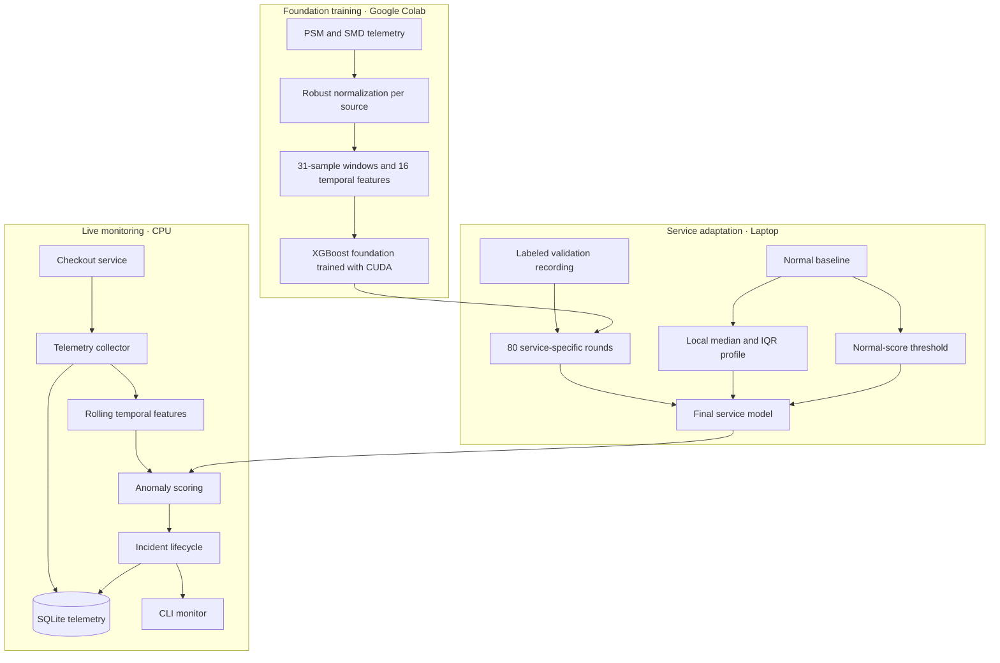

# Architecture

[Back to README](../README.md)

## Training and runtime boundary



Training the foundation model and processing the public datasets happen in
Colab. The laptop adds 80 boosting rounds from the labeled validation recording,
calibrates the threshold from a separate normal baseline, and performs
single-row inference every ten seconds. Numerical libraries are limited to one
thread during local work and inference.

## Source layout

```text
src/service_monitor/
  cli.py                 command-line entry point
  collector.py           telemetry polling and live inference
  incidents.py           incident state machine
  storage.py             SQLite persistence and CSV export
  checkout/              monitored FastAPI service and controlled faults
  ml/
    features.py          public/local universal temporal features
    public_training.py   pinned downloads and the one public model fit
    training.py          local calibration, loading, prediction, evaluation
    evaluation.py        incident-level evaluation
    synthetic.py         small pipeline fixtures
```

Offline evaluation and live monitoring use the same feature builder and incident
state machine. Generated public data, telemetry, model binaries, logs, and
reports stay in the ignored `data/`, `models/`, `runs/`, and `reports/`
directories.
